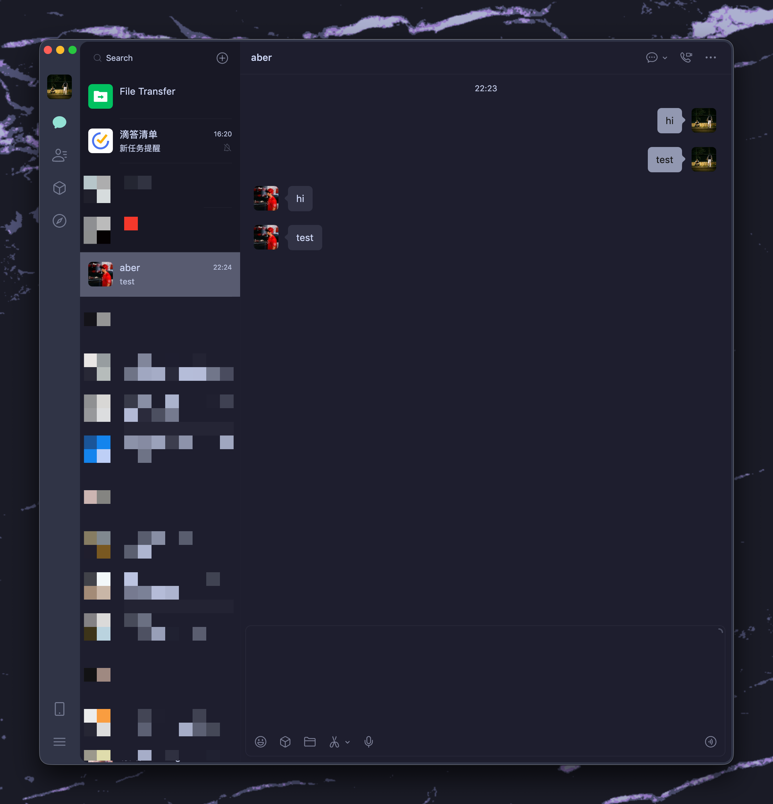
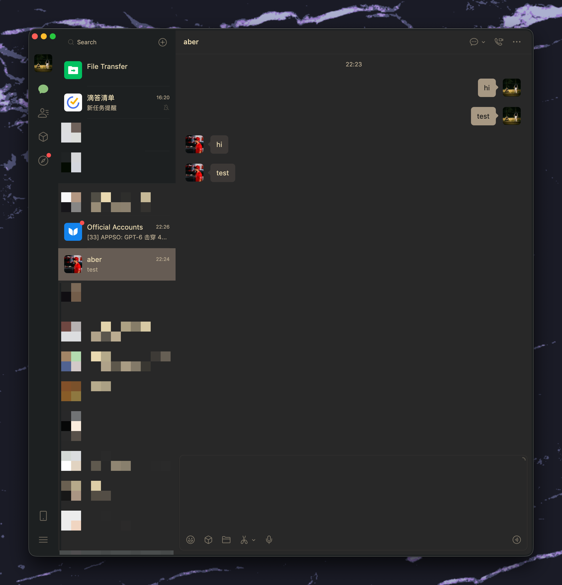

<p align="center">
  
</p>

<h1 align="center">SovietExtension 苏维埃助手</h1>

<p align="center">
  For 开源共产主义，For 理想主义。<br/>
  免费的，抽象的，令人愉快的 Mac 微信插件。
</p>

<p align="center">
  
  
  
  <a href="LICENSE">
    
  </a>
  <a href="https://996.icu">
    
  </a>
</p>

---

## Effect / 效果展示
> 自定义**殺馬特**效果速度、大小、强度，殺馬特or高级感全凭各位自己手艺，我更喜欢殺馬特而已。

> 🔞→嗳丄了祢℡ωǒ…吥徻↘後悔∵╭→很嗳﹎∩ 答应 ↘永逺┈⊕┈与∩ì.在∟┅ ↑起❤️
<p align="center">
  
</p>

<p align="center">
  
</p>

<p align="center">
  
</p>

<p align="center">
  
</p>

<p align="center">
  
</p>

<p align="center">
  
</p>

---

## Global Theme / 全局主题

<table>
  <tr>
    <td align="center"><strong>Catppuccin</strong></td>
    <td align="center"><strong>Gruvbox</strong></td>
  </tr>
  <tr>
    <td></td>
    <td></td>
  </tr>
</table>

支持对微信 4.x Qt/mmui 原生界面应用全局配色，入口：

```text
苏维埃助手 → 主题模式 → 全局主题设置
```

### 内置主题

内置主题为只读配置，可跟随 macOS 浅色 / 深色外观切换：

- Catppuccin（Latte / Mocha）
- Catppuccin Frappé
- Catppuccin Macchiato
- Gruvbox
- Tokyo Night

### 命名自定义主题

可以新建、另存为、复制、重命名和删除多份自定义主题。每份主题都有相互独立的浅色与深色配置，每种外观直接填写以下十个 `#RRGGBB` 色值：

| 色号 | 用途 |
| --- | --- |
| `base` | 主背景 |
| `sidebar` | 会话列表侧栏 |
| `ribbon` | 左侧 Ribbon |
| `outgoing_bubble` | 发出消息气泡 |
| `incoming_bubble` | 收到消息气泡 |
| `text` | 主文字 |
| `subtext` | 次要文字 |
| `accent` | 强调色与品牌控件 |
| `link` | 链接 |
| `danger` | 错误、警告与危险操作 |

色号输入框与系统颜色选择器同步，保存时统一规范化为大写 `#RRGGBB`。这些颜色会直接映射到微信主题键，不会生成调色板、混合颜色、旋转色相或从内置主题继承未填写的颜色。公众号列表与公众号正文内容区还会严格同步 canonical `bg1` / `bg2` 对应的浅色、深色 resolved type=1 镜像；不会因此扩大到其他 type=1/type=243 记录，也不使用灰度扫描、覆盖层或透明混色。

高级用户还可以在“专家设置：微信原始主题键覆盖”中填写命名键覆盖。键名区分大小写，并会在应用前根据当前微信的真实主题表进行结构验证；不存在或不匹配的键会直接拒绝。

自定义主题保存在：

```text
~/Library/Application Support/SovietExtension/themes/
```

每份配置使用独立 UUID 文件。安装器只会安装或更新主题辅助程序，不会覆盖、删除或批量改写已有的用户主题文件。当前应用配置是自包含快照，因此删除源主题后，微信仍会保持最后一次成功应用的效果，直到应用其他主题。

### 安全应用

点击“应用并重启”时会按以下顺序执行：

1. 使用临时配置对真实的 pristine `wechat.dylib` 备份进行只读预检。
2. 验证配置结构、十项色号、专家键、Mach-O 记录和预期补丁数量。
3. 预检通过后才请求确认并退出微信。
4. 始终从原始备份在内存中重新生成完整结果，不在上一次主题上累计修改。
5. 完整验证后通过同目录临时文件原子替换 live dylib。
6. 先签名修改后的 `wechat.dylib`，再签名 `WeChat.app`，最后重新启动微信。

任一步失败都会在修改 live dylib 前停止，或保留原文件不变并清理临时文件。聊天图片、头像、网页、小程序和登录窗口不会被全局配色替换。

左侧 Ribbon 使用 `mmui::MainTabBar` 暴露的原生窗口 backing surface 着色，不使用半透明覆盖层，因此不会混合图标、遮挡会话列表或改变普通 QNSView 的不透明渲染。Catppuccin 深色模式默认使用：

```text
Ribbon       #303446
置顶会话     #181825
普通会话     #1E1E2E
```

> 修改 `wechat.dylib` 后必须先签名该 dylib，再签名完整的 `WeChat.app`。安装器会优先使用 `SOVIET_CODE_SIGN_IDENTITY` 或本机可用的 Apple Development 证书；如果只能使用 ad-hoc 签名，macOS 可能要求重新授予“完全磁盘访问权限”。

---

## Supported Version / 支持版本

> **睁大眼睛看：目前只支持下表列出的 Apple Silicon / M 芯片版本。**
> 本人没有 Intel 机器，无法开发和测试 Intel 版本，所以 Intel 版目前无效。
> 微信 4.x QT 化之后逆向起来比较麻烦，其他版本随缘适配。
> 代码已完全开源，可自行查看，爱你。

请注意：[微信官网](https://mac.weixin.qq.com/) 显示的大版本号可能一致，但实际小版本和 Build 号可能不同。
使用前请务必核对完整版本号和 Build 号。

| 微信版本      | Build 号 | Apple Silicon / M 芯片 | Intel | 下载地址                                                                        | 说明                       |
| --------- | ------: | :------------------: | :---: | --------------------------------------------------------------------------- | ------------------------ |
| 4.1.11.23 |  269079 |         ✅ 支持         | ❌ 不支持 | [Github 归档](https://github.com/zsbai/wechat-versions/releases/tag/4.1.11.23)           | [1.1.2](https://github.com/MustangYM/SovietExtension/releases/tag/1.1.2) 已测试 |
| 4.1.10.53 |  268853 |         ✅ 支持         | ❌ 不支持 | [微信官网](https://weixin.qq.com/updates?platform=mac&version=4.1.10)           | 截止 2026-06-19，我在官网下载到的版本 |

> 不在表格中的版本暂不保证可用。
> 即使大版本看起来一样，只要 Build 号不同，也可能无法使用。

[wechat-versions历史版本下载](https://github.com/zsbai/wechat-versions/releases)
---

## Install / 安装

### 1. 先打开一次微信

如果是刚安装的微信，请先手动打开一次微信，然后再安装插件。

否则安装完成后，可能会提示：

```text
“xxx” 已损坏，无法打开。
```

### 2. 执行安装脚本

进入 `Rely` 文件夹，执行 `install.sh`：

```bash
cd SovietExtension/Rely
sh install.sh
```

或者直接执行完整路径：

```bash
sh /Users/mustangym/SovietExtension/SovietExtension/Rely/install.sh
```

安装过程示例：

```text
mustangym@macdeMacBook-Pro Rely % sh /Users/mustangym/SovietExtension/SovietExtension/Rely/install.sh

==============================
 Install SovietExtension
==============================

APP_PATH=/Applications/WeChat.app
PLUGIN_SRC_PATH=/Users/mustangym/SovietExtension/SovietExtension/Rely/Plugin/SovietExtension.framework
FRAMEWORK_DST_PATH=/Applications/WeChat.app/Contents/MacOS/SovietExtension.framework
INSERT_DYLIB_PATH=/Users/mustangym/SovietExtension/SovietExtension/Rely/insert_dylib
SUPPORTED_FILE=/Users/mustangym/SovietExtension/SovietExtension/Rely/supported_versions.txt
LOAD_DYLIB_PATH=@executable_path/SovietExtension.framework/SovietExtension

👉 [INFO] Detected WeChat version / 检测到微信版本:
    CFBundleShortVersionString: 4.1.9
    CFBundleVersion:            268602

✅ [OK] Version supported / 版本检查通过
    Supported Display Version: 4.1.9.58
    Matched Rule:              4.1.9.58|4.1.9|268602|Tested on Mac WeChat 4.1.9.58

...省略一万句...

👉 [INFO] Verify code signature / 检查签名...
⚠️  [WARN] Code signature verification failed, but app may still run for debugging / 签名验证未完全通过，但调试运行不一定受影响

==============================
✅ SovietExtension installed successfully
✅ SovietExtension 安装完成
==============================

Run WeChat and watch log / 启动微信并查看日志：
  rm -f /tmp/YMWeChatAntiRevokePatch.log
  open -a WeChat
  tail -f /tmp/YMWeChatAntiRevokePatch.log

Uninstall / 卸载：
  /Users/mustangym/SovietExtension/SovietExtension/Rely/uninstall.sh
```

### 3. 开发构建不会自动安装

Xcode 的常规构建默认只生成产物，不会修改 `/Applications/WeChat.app`。只有明确设置以下环境变量时，构建阶段才会调用安装流程：

```bash
SOVIET_INSTALL_AFTER_BUILD=1
```

只有精确值 `1` 会启用安装；未设置、`0`、`true`、`01` 等值均为安全的 no-op。日常开发与测试请保持该变量未设置。

如果希望安装器使用稳定的开发证书签名，可以指定：

```bash
SOVIET_CODE_SIGN_IDENTITY="Apple Development: name@example.com (TEAMID)" \
bash install.sh
```

不建议依赖 ad-hoc 签名，因为签名身份变化可能导致 macOS 重新请求隐私权限。

---

## Troubleshooting / 常见问题

### 1. 提示 `Operation not permitted`

如果安装时报错：

```text
cp: xxxxx: Operation not permitted
```

请到：

```text
系统设置 → 隐私与安全性
```

给你当前运行脚本的“终端工具”开启以下权限：

| 权限                          | 说明         |
| --------------------------- | ---------- |
| 完整磁盘访问权限 / Full Disk Access | 允许脚本修改应用目录 |
| 文件与文件夹 / Files and Folders  | 允许访问相关文件   |

常见终端工具包括：

* Terminal / 终端
* iTerm2
* VSCode
* Cursor
* Warp

你用哪个工具执行脚本，就给哪个工具开权限。

### 2. 如果反复弹窗提示[”微信“想访问其他App的数据]
```text
在系统设置中打开微信”完全磁盘访问“，如果微信已经在里面，则删除后重新添加。
```

---

### 3. 提示版本不支持

请确认你的微信版本和 Build 号是否在支持表格中。

查看方式：

```bash
defaults read /Applications/WeChat.app/Contents/Info.plist CFBundleShortVersionString
defaults read /Applications/WeChat.app/Contents/Info.plist CFBundleVersion
```

只有表格中明确列出的版本才保证可用。

---

### 4. 安装后微信打不开

可以先执行卸载脚本恢复：

```bash
sh /Users/mustangym/SovietExtension/SovietExtension/Rely/uninstall.sh
```

如果仍然打不开，可以删除微信后重新安装官方版本。

---

## Uninstall / 卸载

进入 `Rely` 文件夹，执行：

```bash
sh uninstall.sh
```

或者直接执行完整路径：

```bash
sh /Users/mustangym/SovietExtension/SovietExtension/Rely/uninstall.sh
```

---

## Notes / 说明

* 本项目仅用于学习、研究与个人折腾。
* 代码完全开源，可自行查看实现。
* 不接受除 Bug 以外的任何 Issue。
* 不接受任何形式的捐赠与收费。
* 其他版本适配随缘，别催，催就是你对。

---

## Thanks / 致谢

感谢湖畔大学全体同学。

**瑞思拜。**

MustangYM.

---

## License / 开源协议

<a href="LICENSE">
  
</a>

<a href="https://996.icu">
  
</a>
